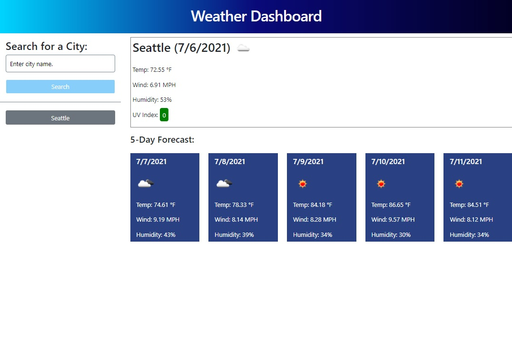
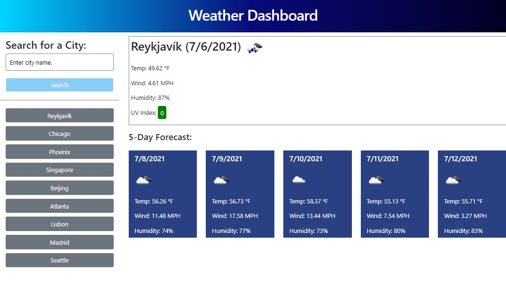
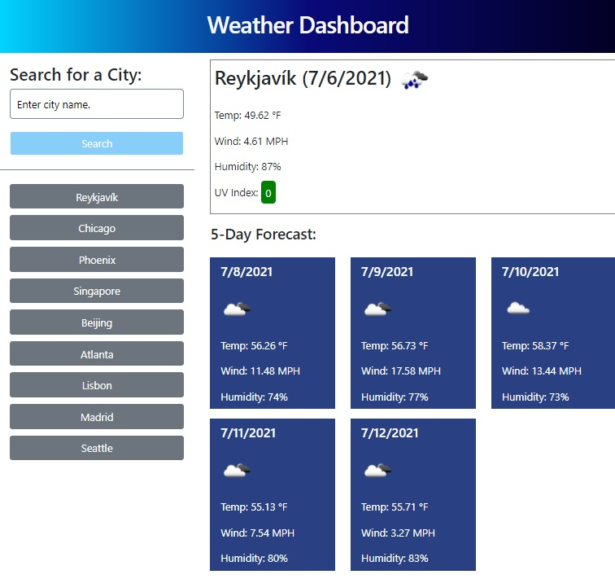
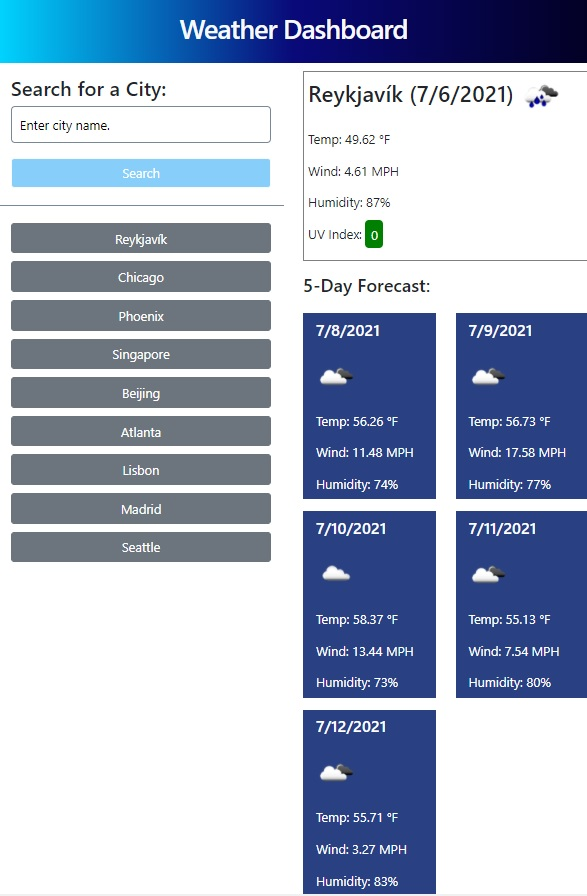
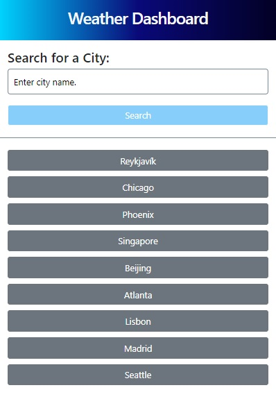
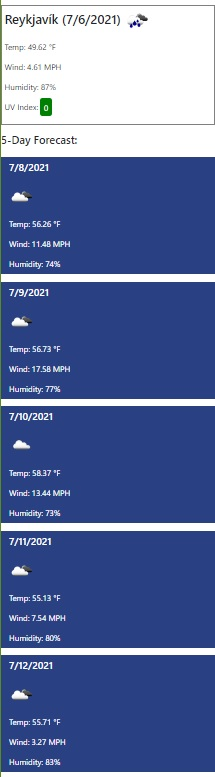

# Weather Dashboard

## Task

Search for and retrieve weather information via the Open Weather API for selected cities, display a multi-day forecast, and store search information in localStorage for later retrieval.

## Process

Wireframing was fairly simple as the app has a straightforward layout with clearly defined sections, and all results are displayed on the same page. Pseudo-coding was again essential to the planning of the code in the Javascript file as there were multiple functions that needed to work seamlessly together over the course of 2 different (but similar) API calls.

Most of the HTML layout is static with the exception of the 5-day forecast section, which is built dynamically when a function is called to obtain forecast information. All is styled with Bootstrap. Although the overall layout will not change and it is a small app, I thought it would be more efficient to reduce code. Most of the elements in the HTML have IDs which are manipulated with Javascript in the background.

The user types a city name into the search bar. The app will display an alert if the submitted name is either blank or not in the Open Weather database, and do nothing. If a city name is valid, an API call comes back with latitude and longitude data, which is then sent to the server via a more complex API call. This returns current and forecast information as well as appropriate weather icons to diplay on each day of the forecast. The city name is also saved in an array displayed on the left under the search bar, and internally in the browser's local storage which will persist through page reload. Clicking on a recent city will move it to the top of the list.

The app is also size-responsive, rearranging the sections of the page to fit depending on screen size.

## Resources

I used the examples we went over in class sessions and materials to create this site. I also consulted various tutorial and general resources websites including:

* OpenWeatherMap.org
* W3Schools.com
* developer.mozilla.org
* StackOverflow.com
* StackExchange.com
* jQuery.com

## Link to Deployed Github Page

[Weather Dashboard](https://rangamboa.github.io/weather-dashboard)

## Screenshots

Full-size screen, single city information display:

Full-size screen, multiple cities saved in search history on the left:

Medium-size screen, responsive reconfiguration of forecast information:

Small-size screen, responsive reconfiguration of forecast information:

Mobile-size screen, single column display of all information:\n

Mobile-size screen, single column display of all information:\n

- - -
© 2021 Ran Gamboa
